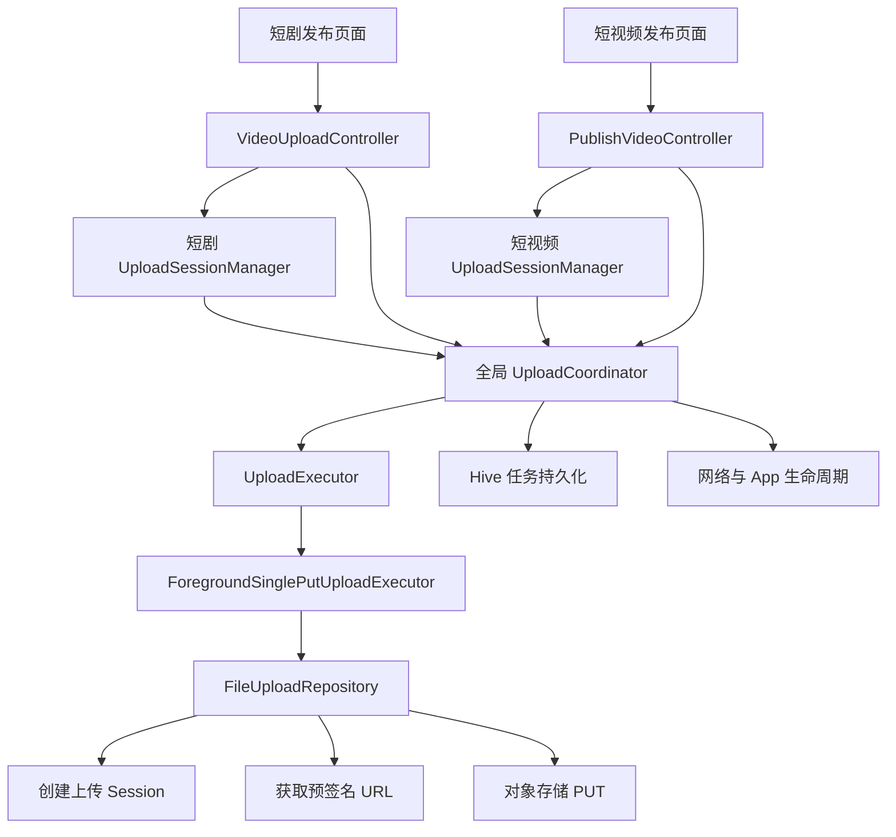
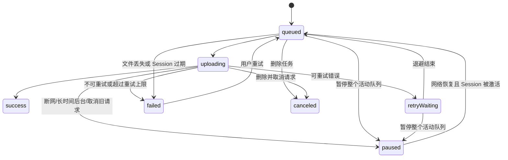

# 短剧与短视频上传核心设计说明

> 文档状态：基于当前实现整理  
> 更新日期：2026-08-26  
> 适用范围：发布短剧中的剧集视频、发布短视频中的视频文件

## 1. 设计结论

当前采用“一个全局视频上传核心，两个独立业务流程”的结构：

- 短剧和短视频共用 `UploadCoordinator`、`UploadTask`、`UploadExecutor`、`FileUploadRepository` 和错误模型。
- 两个业务流程分别持有自己的 `UploadSessionManager`，避免业务状态互相污染，同时允许未来并行创建短剧和短视频。
- `uploadSessionId` 同时作为后端资源归属标识和队列任务分组标识，不额外增加 `flowId` 或业务来源字段。
- 当前上传执行器是前台单次 PUT：不支持系统级后台上传，也不支持断点续传。
- App 短暂进入后台时不主动中断请求；后台时间较长或回前台后检测到进度停滞时，取消旧请求并从文件起点重新上传。
- 已成功上传的同批文件不会因为其他文件失败而重新上传。

这一结构保留了后续替换为分片上传或原生后台上传的扩展点，业务页面不需要直接感知底层传输方式。

## 2. 目标与非目标

### 2.1 当前目标

- 只维护一套视频上传队列、状态机、重试、持久化和生命周期恢复逻辑。
- 支持短剧多集视频和短视频单文件两种业务形态。
- 页面销毁、草稿恢复、网络切换和 App 前后台切换后，任务状态可恢复。
- 上传失败信息对用户友好，同时保留可用于排查的诊断码。
- 避免账号切换后复用其他账号的任务或上传会话。
- 控制进度更新和本地持久化频率，避免大文件上传时产生过多 rebuild 和磁盘写入。

### 2.2 当前非目标

- 不实现 iOS/Android 系统级后台传输。
- 不实现分片上传和字节级断点续传。
- 不把封面图片纳入全局上传队列；封面目前仍通过 `FileUploadRepository` 直接上传。
- 不支持同一任务并发上传多个分片。
- 不保证 App 被系统终止后上传仍在继续；进程恢复后只恢复任务记录，等待对应草稿重新打开后继续。

## 3. 总体架构



### 3.1 分层职责

| 层 | 核心文件 | 职责 |
|---|---|---|
| 业务页面 | `create_drama_page.dart`、`publish_video_page.dart` | 展示状态、触发选择/重试/删除/发布、生命周期时刷新草稿 |
| 业务控制器 | `video_upload_controller.dart`、`publish_video_controller.dart` | 构造任务、同步 UI 状态、管理业务表单和草稿 |
| Session 管理 | `upload_session_manager.dart` | 创建、复用、恢复和安全替换 `uploadSessionId` |
| 全局协调 | `upload_coordinator.dart` | 队列调度、状态机、重试、取消、恢复、持久化和生命周期处理 |
| 执行器 | `UploadExecutor` | 隔离具体传输策略，当前实现为前台单次 PUT |
| 上传仓储 | `file_upload_repository.dart` | 创建 Session、获取预签名凭证、执行对象存储上传 |
| HTTP 传输 | `story_api_client.dart` | 流式写入文件、进度回调、超时、取消和响应资源释放 |
| 错误模型 | `upload_failure.dart` | 将原始网络/API 错误转换为安全且可本地化的错误类型和诊断码 |

## 4. 核心数据模型

### 4.1 UploadTask

`UploadTask` 是全局队列的持久化最小单元，主要字段如下：

| 字段 | 用途 |
|---|---|
| `id` | 任务唯一标识，同时关联业务 UI 项 |
| `localFilePath` | App 托管目录中的文件路径 |
| `fileName` / `fileSize` / `contentType` | 上传元数据 |
| `category` | 后端文件类别，视频为 `episode` |
| `ownerUserId` | 账号隔离，防止换号后串用任务 |
| `uploadSessionId` | 后端资源归属及队列分组标识 |
| `uploadSessionExpiresAt` | Session 过期判断依据 |
| `status` / `progress` / `retryCount` | 任务状态、进度和重试次数 |
| `objectKey` / `publicUrl` | 成功后的业务提交数据 |
| `lastError` | 安全编码后的错误信息 |

预签名 URL 不写入任务，也不持久化。每次真正执行或重新执行上传时，都会重新获取预签名 URL，避免复用已过期的临时凭证。

### 4.2 任务状态机



进程恢复时，原来的 `queued`、`uploading` 和 `retryWaiting` 都会转换为 `paused`，因为新的进程不可能继续持有旧的 Dart Socket。

## 5. 标准上传流程

### 5.1 文件准备

1. 页面通过文件选择器选择视频。
2. 业务控制器读取文件大小、时长、宽高等元数据。
3. 校验文件约束；当前单个视频上限为 2GB，短剧最多 100 集。
4. `UploadCoordinator.adoptFile` 将选择器提供的文件复制到：

   `ApplicationSupport/managed_uploads/<taskId>/`

5. 后续重试和草稿恢复只依赖 App 托管文件，不依赖系统选择器的临时路径。

### 5.2 Session 获取

`UploadSessionManager.ensure()` 按以下规则工作：

1. 当前 Session 存在、未过期且账号未变化：直接复用。
2. Session 不存在：请求创建新 Session。
3. Session 已过期且没有任何成功资源：创建新 Session，并将未完成任务整体换绑到新 Session。
4. Session 已过期但已有成功视频或封面资源：拒绝自动换绑，避免一个发布请求引用两个 Session 下的资源。
5. 同一流程同时触发多次 `ensure()` 时复用同一个创建 Future，避免重复创建 Session。

Session 创建接口：

```text
POST /api/mini-drama/creator/uploads/sessions
```

### 5.3 入队与调度

业务控制器构造 `UploadTask` 后交给全局 `UploadCoordinator`：

- 当前并发数为 1，避免多个大视频同时争用带宽和内存。
- 不同 `uploadSessionId` 之间采用轮转选择，防止短剧的大批量剧集长期阻塞短视频任务。
- 同一个 Session 内保持任务原有队列顺序。
- 只有当前账号的任务才允许执行。
- 只有已激活 Session 下的暂停任务才会在恢复网络或回到前台后继续。

### 5.4 真正上传

每次执行任务包含两步：

1. 获取预签名上传凭证：

   ```text
   POST /api/mini-drama/creator/uploads/presign
   ```

   请求携带 `contentType`、`fileCategory`、`fileName` 和 `uploadSessionId`。

2. 使用后端返回的 URL 和要求的 Header，直接上传到对象存储：

   ```text
   PUT <presigned upload URL>
   ```

文件通过 `File.openRead()` 流式读取，不会一次性加载到内存。上传成功后返回 `objectKey` 和去除签名查询参数后的 `publicUrl`；业务发布主要使用 `objectKey`。

HTTP 响应体会被消费并丢弃，以便安全释放或复用连接，同时避免把对象存储的原始错误正文直接暴露给用户。

### 5.5 业务提交

视频文件上传成功不等于内容已经发布，最终还需要提交业务数据：

| 业务 | 接口 | 关键数据 |
|---|---|---|
| 发布短剧 | `POST /api/mini-drama/creator/dramas` | `uploadSessionId`、封面 `objectKey`、每集视频 `objectKey`、时长、宽高、集序等 |
| 发布短视频 | `POST /api/mini-drama/creator/short-videos` | `uploadSessionId`、视频 `objectKey`、封面 `objectKey`、时长、宽高和描述 |

业务提交成功后再删除相应草稿和本地托管资源。上传成功但业务提交失败时应保留资源引用和草稿，允许用户重新提交。

## 6. 两个业务流程的差异

### 6.1 发布短剧

- 支持一次选择和上传多个剧集视频，最多 100 个。
- 新建模式按文件名自然排序，用户仍可手动调整剧集顺序。
- 每集维护独立描述、时长、宽高、缩略图、上传状态和进度。
- 所有新剧集与封面必须属于同一个 `uploadSessionId`。
- 单个文件失败只影响该文件，已成功的其他剧集保持成功状态。
- 页面展示：
  - 上传中：`1.0 MB / 10.4 MB · 10:12`
  - 其他状态：`10.4 MB · 10:12`
- 创建提交时只使用成功视频构造剧集列表；进入下一步前要求已选择视频全部上传成功。

### 6.2 发布短视频

- 一个发布流程只维护一个视频任务，重新选择会替换并删除旧任务。
- 视频上传完成后保存 `objectKey`，并与封面共用同一 Session。
- 自动从视频生成缩略图作为默认封面；用户手动封面优先级更高。
- 视频上传由全局队列执行；自动封面和手动封面当前仍由仓储直接上传。
- 失败后可以直接使用 App 托管文件重试，不需要重新选择文件。

## 7. App 生命周期与网络恢复

当前策略用于解决“刚进入后台又立即回来时不应重头上传，但后台较久后原请求可能已经失效”的问题。

### 7.1 进入后台

- `inactive`：通常是短暂系统遮罩，不处理上传请求。
- `hidden` / `paused`：记录进入后台的时间，不立即取消正在上传的请求。
- `detached`：立即取消活动请求并将任务暂停。
- 页面控制器同时刷新草稿，确保表单、Session 和任务引用尽快落盘。

### 7.2 返回前台

- 后台时间小于 20 秒：保留原请求，不从头上传。
- 后台时间达到或超过 20 秒：取消可能失效的旧请求，将未完成任务进度归零并重新排队。
- 回前台后若活动任务连续 15 秒没有任何进度：判定连接可能假活，取消旧请求并重新上传。
- 每次重新上传都会重新获取预签名 URL。

### 7.3 网络变化

- 断网：立即取消活动请求，任务进入 `paused`。
- 网络恢复且 App 在前台：只恢复当前账号、且 Session 处于激活状态的暂停任务。
- 当前不支持字节级续传，因此恢复的是“任务”，不是“已经上传的字节”；当前文件会从 0 开始，同批已成功文件不受影响。

## 8. 自动重试策略

可重试错误包括网络错误、超时、限流和未知传输错误：

- 最多自动重试 3 次。
- 指数退避时间为 1 秒、2 秒、4 秒。
- 重试前任务进入 `retryWaiting`。
- Session 过期、文件丢失、认证失败、明确的业务拒绝等错误不盲目自动重试。
- 用户主动重试会清空旧进度、重试次数和错误，并重新排队。

## 9. 持久化与草稿恢复

### 9.1 队列持久化

全局队列写入 Hive，当前键为：

```text
foreground_upload_tasks:v2
```

持久化内容包括本地路径、账号、Session、状态、进度、重试次数、成功 `objectKey` 和安全错误信息，但不包含预签名 URL。

为降低写入压力：

- UI 进度变化小于 1% 且距离上次更新不足 200ms 时忽略。
- 任务进度跨越 10% 桶时才触发一次持久化。
- 持久化请求串行排队，避免旧快照覆盖新快照。

### 9.2 草稿恢复

- 短剧草稿保存表单、视频任务 ID、本地托管路径、成功 `objectKey`、Session 及过期时间。
- 短视频草稿保存对应的单视频信息、封面信息、Session 及过期时间。
- App 重启后，全局队列先恢复为暂停状态。
- 用户重新打开对应草稿时，业务控制器通过 `UploadSessionManager.restoreTasks()` 重建缺失任务并激活对应 Session。
- `activeSessions` 只保存在内存中，避免 App 启动后在用户没有打开草稿的情况下自动上传所有历史任务。

## 10. 账号与并发安全

- 每个任务记录 `ownerUserId`，调度、查询、重试和删除均校验当前账号。
- 账号切换时取消当前活动请求、清空活动 Session；旧账号任务仍按账号隔离保留，便于该账号以后恢复草稿。
- 每次异步选择、Session 创建和上传尝试都使用 generation 校验，过期回调不能覆盖新状态。
- 删除或重启任务时通过 `UploadCancelToken` 中止 `HttpClientRequest`。
- 成功资源存在时禁止自动替换已过期 Session，避免跨 Session 提交资源。

## 11. 错误展示与排查

底层错误会转换为 `UploadFailure`，持久化内容不包含原始异常文本或对象存储响应正文。UI 展示本地化提示，并附带稳定诊断码，例如：

| 场景 | 诊断码示例 |
|---|---|
| 网络异常 | `UP-NET` |
| 上传超时 | `UP-TIMEOUT` |
| Session 过期 | `UP-SESSION-EXPIRED` |
| 本地文件丢失 | `UP-FILE` |
| 鉴权失败 | `UP-AUTH · HTTP 403` |
| 服务端异常 | `UP-SERVER · HTTP 503` |
| 业务拒绝 | `UP-REJECT · SVC 100xxx` |

日志可以保留底层异常用于开发排查，但用户界面和持久化任务只保留安全分类及必要状态码。

## 12. 当前性能设计

- 文件采用流式读取，不把整个视频加载到内存。
- 全局默认单并发，降低大视频同时上传造成的带宽竞争、发热和内存压力。
- 进度回调节流，减少 Riverpod 状态更新和 Widget rebuild。
- Hive 进度按桶持久化，减少闪存写入。
- HTTP 响应通过 `drain<void>()` 消费并丢弃，不构造无用的大字符串，并允许连接安全释放或复用。
- 文件只在进入托管目录时复制一次；换取新预签名 URL和自动重试不会重复复制文件。

需要注意：复制一个接近 2GB 的视频到 App 托管目录会消耗时间和额外磁盘空间，但这是保证页面退出、选择器临时文件失效和进程恢复后仍可重试的必要成本。

## 13. 已知限制与风险

1. 当前没有断点续传，网络恢复、Session 替换或长时间后台恢复时，活动文件从 0 开始上传。
2. iOS/Android 可能在后台挂起 Dart isolate；短后台保留请求只是减少不必要重传，不代表具备系统后台上传能力。
3. 进度表示客户端已向网络层写出的字节比例，不等同于服务端已持久化比例。
4. 封面上传未进入全局队列，因此暂不共享队列持久化、统一重试和生命周期恢复能力。
5. 全局单并发优先保证稳定性；在高速 Wi-Fi 下，多文件总耗时可能不是最优。
6. Session 已过期且已有成功资源时不能安全自动换绑，需要后端提供资源迁移、延长 Session 或重新上传整批资源的明确协议。
7. 需要持续清理被放弃草稿和异常退出遗留的托管文件，避免长期占用磁盘。

## 14. 未来演进建议

### 14.1 第一阶段：先补齐可观测性和资源治理

建议优先完成，改动小且直接提升线上可维护性：

- 记录任务排队耗时、上传耗时、平均速度、重试次数、失败类型、后台重启次数和最终成功率。
- 日志统一携带脱敏后的任务 ID、Session ID 尾号、文件大小、重试序号和诊断码。
- 增加托管目录磁盘空间预检：复制前至少保证“文件大小 + 安全余量”的可用空间。
- 增加孤儿任务/文件清理策略，例如已删除草稿立即清理，超过 7 天未引用的暂停或失败任务定期清理。
- 在上传完成但业务提交失败的场景增加明确的“重新发布”入口，避免用户重新上传。

### 14.2 第二阶段：实现分片与断点续传

这是最值得优先建设的传输升级，尤其适合大于数百 MB 的视频。

建议保留 `UploadCoordinator` 和业务控制器，只新增或替换执行器，例如：

```text
UploadExecutor
├── ForegroundSinglePutUploadExecutor   当前实现
└── MultipartResumableUploadExecutor    未来实现
```

任务模型需要新增可持久化的断点信息：

- `multipartUploadId`
- `partSize`
- `completedParts`（partNumber、ETag、校验值）
- `uploadedBytes`
- 分片凭证过期时间或重新签名能力
- 上传协议版本

后端需要配套提供：

1. 初始化分片上传。
2. 获取单个或一批分片的预签名 URL。
3. 查询已完成分片。
4. 完成合并。
5. 取消分片上传并清理对象存储残片。

实现时应将 Hive 存储键升级到新版本，并提供 v2 单 PUT 任务到新模型的兼容迁移。无法迁移的旧活动任务可安全回退为从头上传。

建议分片大小根据文件和网络条件控制在 8MB～32MB，并限制并发分片数，避免手机发热、内存上涨和蜂窝网络拥塞。

### 14.3 第三阶段：接入系统后台传输

在断点续传稳定后再做原生后台上传更合理。可新增：

```text
UploadExecutor
└── NativeBackgroundUploadExecutor
```

推荐方案：

- iOS：基于 background `URLSession`。
- Android：基于系统调度能力，长任务结合 Foreground Service，延迟恢复结合 WorkManager。
- 原生层只负责传输和事件落盘，Flutter 层的 `UploadCoordinator` 仍是任务状态的统一入口。
- App 启动或回前台时，对账原生任务、Hive 任务和后端分片状态，再更新 UI。
- 不把长期有效凭证写入普通日志或不安全存储；短期预签名过期后应支持重新签名。

系统后台能力接入后，`supportsBackground` 返回 `true`，业务页面无需改写上传流程。

### 14.4 第四阶段：智能调度

在稳定性和监控数据充分后再考虑性能优化：

- 蜂窝网络保持单并发；Wi-Fi 且设备状态允许时提高到 2 个文件并发。
- 分片并发与文件并发分开配置，设置全局带宽和内存预算。
- 支持“仅 Wi-Fi 上传”、低电量暂停、用户手动暂停/继续和上传顺序调整。
- 在多个 Session 并存时继续保持公平调度，并允许当前前台业务获得有限优先级，但不能长期饿死后台草稿任务。

### 14.5 封面上传的后续统一

当前不建议为了形式统一立即把封面塞进视频队列。等视频上传核心稳定后，可以评估将通用媒体任务扩展为：

- 视频使用可恢复执行器。
- 小图片使用单 PUT 执行器。
- 两者共用 Session、错误模型、持久化和生命周期入口。

届时应以 `FileCategory` 和执行策略决定传输方式，而不是在业务控制器内写条件分支。

## 15. 推荐实施顺序

| 优先级 | 建议 | 原因 |
|---|---|---|
| P0 | 指标、日志、磁盘预检和孤儿文件清理 | 风险低，先建立线上判断依据 |
| P1 | 后端分片协议与断点续传执行器 | 直接解决大文件重传成本 |
| P1 | Session 过期后的资源续期或迁移协议 | 解决“部分成功后 Session 过期”的恢复难点 |
| P2 | 原生系统后台上传 | 提升长时间后台场景成功率，实施复杂度较高 |
| P2 | 封面进入统一媒体任务体系 | 统一恢复体验，但当前不是视频主链路阻塞项 |
| P3 | 网络感知的动态并发和用户上传策略 | 依赖真实监控数据调优 |

## 16. 测试建议

至少保持以下自动化与真机测试：

- 单任务成功、失败、自动重试耗尽、用户重试。
- 多 Session 轮转调度，验证大批短剧任务不会饿死短视频任务。
- App 短后台后返回，确认原请求和进度不被重置。
- App 长后台后返回，确认活动文件从 0 重新上传、成功兄弟文件不重传。
- 回前台后模拟假活连接，确认 15 秒无进度会重启。
- 上传中断网与网络恢复。
- 进程终止后恢复草稿，确认任务先暂停、打开草稿后再激活。
- Session 未过期复用、无成功资源时过期换绑、有成功资源时拒绝换绑。
- 上传过程中切换账号，确认旧回调不能更新新账号 UI。
- 删除上传中任务，确认请求取消、Hive 记录和托管文件均正确清理。
- 2GB 边界、磁盘空间不足、文件被系统删除、预签名响应无效。
- 业务提交失败后重新提交，确认不重复上传已经成功的视频。

## 17. 维护约束

- 新的视频上传入口必须通过 `UploadCoordinator`，不要在业务 Controller 中直接实现另一套视频 PUT。
- 业务流程各自创建 `UploadSessionManager`，不要把可变 Session 状态做成单一全局实例。
- `uploadSessionId` 足以完成任务分组；除非出现同一 Session 内需要区分不同调度域的真实需求，否则不要增加 `flowId`。
- 预签名 URL 不得持久化或输出完整日志。
- UI 不直接展示底层异常、对象存储响应正文或敏感 URL。
- 修改生命周期阈值、重试次数和调度策略时，应同步更新对应单元测试和本文档。
- 新增后台或断点续传能力时优先实现新的 `UploadExecutor`，避免让业务页面依赖平台传输细节。

