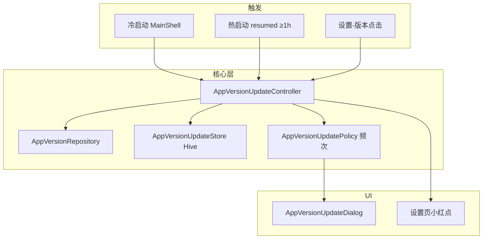

# PRD V3.0 App 版本更新 — 分步开发计划

> 创建日期：2026-09-02  
> 产品：`prd/PRD_V3.0_App版本更新管理.docx`  
> 接口：`prd/3.0 App版本更新接口.md`  
> OpenAPI（本地）：`web-onestory-www/api-admin.yaml`  
> 开发原则：**按 Step 顺序推进，每步完成后自测 + 勾选，再进入下一步。**

---

## 0. 背景与范围

### 目标

客户端在合适时机调用版本检查接口，按 PRD 展示更新弹窗、控制频次、跳转商店/APK，并在设置页展示版本号与小红点。

### 不在本需求内

- 后管配置页面（Web Admin）
- 强更穿透的服务端逻辑（客户端只消费 `type`）
- iOS TestFlight / 企业包特殊逻辑

### 接口契约（dev 已验证）

```
GET /api/admin/v1/app-version-updates/check?channel={ios|android|apk}&version_name={semver}
Base: effectiveApiBaseUrl（与 globalConfig 相同网关）
鉴权: 无
```

| 响应字段 | 说明 |
|----------|------|
| `need_update` | `false` → 不弹窗 |
| `type` | `Remind` / `Force` / `Click`（大小写以接口为准） |
| `version_name` | **目标版本** |
| `download_url` | 跳转链接；空则容错不弹 |
| `contents` | `{ zh, en, ja, es, vi, tr }` 多语言公告 |

### 架构总览



---

## 1. 待确认项（开发前 / Step 1 并行）

| # | 问题 | 暂定方案 | 状态 |
|---|------|----------|------|
| 1 | Android Play vs 官网 APK 如何区分 `channel`？ | 默认 `android`；CI/APK 包加 `--dart-define=DISTRIBUTION_CHANNEL=apk` | ✅ CI 已注入 |
| 2 | `type=Click` 时自动检查是否弹窗？ | 自动检查：仅 `Remind`/`Force` 弹；`Click` 仅设置页主动检查弹 | ✅ 已实现 |
| 3 | 强制更新是否提供「退出 App」？ | PRD：次按钮不展示；仅「立即更新」+ 拦截返回键 | ✅ 已实现 |
| 4 | 版本比较是否客户端再做？ | **否**，以服务端 `need_update` 为准 | ✅ |

---

## Step 1 — 数据层（Model + Repository）

**目标：** 能独立调用接口并解析 DTO，无 UI。

### 任务

- [ ] 新增 `lib/src/model/app_version_update_model.dart`
  - `AppVersionUpdateContents`（6 语种 optional String）
  - `AppVersionUpdateCheckResponse`（`need_update`, `type`, `version_name`, `download_url`, `contents`）
  - `fromJson` / `@JsonKey` snake_case
- [ ] 新增 `lib/src/repositories/app_version_repository.dart`
  - `checkUpdate({required String channel, required String versionName})`
  - `GET /api/admin/v1/app-version-updates/check` + query
  - 复用 `StoryApiClient.safeGet` + `decodeWith`
- [ ] `repository_providers.dart` 注册 `appVersionRepositoryProvider`
- [ ] 新增 `lib/src/utils/app_distribution_channel.dart`
  - `resolveDistributionChannel()` → `ios` | `android` | `apk`
  - iOS: `Platform.isIOS` → `ios`
  - Android: 读 `String.fromEnvironment('DISTRIBUTION_CHANNEL', defaultValue: 'android')`
- [ ] 新增 `lib/src/utils/app_version_update_content_resolver.dart`
  - 输入 `AppVersionUpdateContents` + `Locale` → 展示文案
  - 映射：`zh`/`en`/`ja`/`es`/`vi`/`tr`；缺省 `en`
- [ ] 单元测试 `test/repositories/app_version_repository_test.dart`
- [ ] 单元测试 `test/utils/app_version_update_content_resolver_test.dart`

### 验收

```bash
# dev 真机/模拟器日志或临时 debug 按钮能打出 need_update
flutter test test/repositories/app_version_repository_test.dart
flutter test test/utils/app_version_update_content_resolver_test.dart
```

---

## Step 2 — 本地状态与频次策略

**目标：** 实现 PRD 弹窗频次，不依赖 UI。

### 任务

- [ ] 新增 `lib/src/services/app_version_update_store.dart`（Hive）
  - `lastCheckAtMs` — 热启动 1h 节流
  - `dismissedTargetVersion` + `dismissedUtcDay` — Remind「以后再说」UTC 自然日
  - `lastKnownNeedUpdate` — 设置页小红点（可选，或内存 + 上次检查结果）
- [ ] 新增 `lib/src/controller/app_version_update_policy.dart`（纯函数，易测）
  - `shouldFetchNow(trigger, lastCheckAt, now)` — 冷启动 true；热启动 ≥1h；设置页 true
  - `shouldShowDialog(result, trigger, store, now)` — Force 永远弹；Remind 日限 1 次；Click 仅 manual
  - `markDismissed(targetVersion, now)` / `markChecked(now)`
- [ ] 单元测试 `test/controller/app_version_update_policy_test.dart`
  - Force 每次 true
  - Remind 同版本同日 dismiss 后 false
  - Remind 次日 true
  - 目标 `version_name` 变更后立即 true

### 验收

```bash
flutter test test/controller/app_version_update_policy_test.dart
```

---

## Step 3 — Controller / Coordinator

**目标：** 串联 Repository + Policy + Store，对外暴露「检查并决定是否弹窗」。

### 任务

- [ ] 新增 `lib/src/controller/app_version_update_controller.dart`（Riverpod `Notifier` 或 `AsyncNotifier`）
  - 状态：`AppVersionUpdateUiState`（`idle` / `checking` / `updateAvailable` / `upToDate` / `failedSilent`）
  - `checkOnLaunch()` — 冷启动
  - `checkOnResume()` — 热启动（内部 1h 节流）
  - `checkFromSettings()` — 设置页；`upToDate` 时供 UI Toast
  - 失败：静默，`failedSilent` 不阻断
  - 容错：`need_update=false` / `download_url` 空 / 解析异常 → 不弹
- [ ] 新增 `app_version_update_provider.dart`
- [ ] 读取 `PackageInfo.version` 作为 `version_name`（controller 内或 injectable helper）

### 验收

- 临时在 `MainShellPage.initState` 打日志，冷启动能走到 `updateAvailable` / `upToDate`
- 断网时不 crash、不弹窗

---

## Step 4 — 更新弹窗 UI

**目标：** 按 PRD 展示弹窗，支持 Remind / Force 两种交互。

### 任务

- [ ] 新增 `lib/src/components/common/app_version_update_dialog.dart`
  - 标题：i18n「发现新版本」/ "New Version Available"
  - 内容：`SingleChildScrollView` 展示 `contents` 解析后的长文
  - 主按钮：「立即更新」→ `StoryLauncher.openExternal(download_url)`
  - 次按钮（Remind / Click）：「以后再说」→ dismiss + `markDismissed`
  - Force：`PopScope(canPop: false)`，隐藏次按钮，拦截 Android 返回
- [ ] 新增 l10n keys（7 语种 arb）：
  - `appVersionUpdateTitle`
  - `appVersionUpdateConfirm`
  - `appVersionUpdateLater`
- [ ] 运行 `flutter gen-l10n`

### 验收

- Remind：可关闭，点「以后再说」当天不再弹（Step 5 联调验证）
- Force：无法关闭，只能点更新或杀进程

---

## Step 5 — 生命周期接入（冷启动 / 热启动）

**目标：** 自动检查链路打通。

### 任务

- [ ] `MainShellPage`（或 `_AppBootstrap` / `StoryRootBuilder`）：
  - `initState` / 首帧后：`checkOnLaunch()`
  - `didChangeAppLifecycleState(resumed)`：`checkOnResume()`
  - 监听 `appVersionUpdateProvider`，当 `updateAvailable` 时用 `StoryNavigator` 弹 `AppVersionUpdateDialog`
  - **注意：** 确保有 `context` / `navigatorKey`；Force 时 dialog 置顶且不可被 Tab 切换盖掉
- [ ] 避免与 `DeletingPage` / 登录 gate 竞态：pending deletion 完成后再弹，或 Force 时覆盖

### 验收

| 场景 | 期望 |
|------|------|
| 冷启动 + need_update + Remind | 弹窗 1 次 |
| 切后台再回前台（<1h） | 不重复请求 |
| 切后台再回前台（≥1h） | 再次请求；Force 则再弹 |
| 弱网 | 静默进入 App |

---

## Step 6 — 设置页

**目标：** 版本行 + 小红点 + 主动检查。

### 任务

- [ ] 改造 `lib/src/view/settings_page.dart` `_VersionRow`
  - 展示 `V{version}`（已有）
  - 非最新：右侧小红点（`need_update` 且上次检查有更新）
  - `onTap` → `checkFromSettings()`：
    - 最新 → `StoryToast.success(settingsVersionLatestToast)`（已有文案）
    - 非最新 → 弹 `AppVersionUpdateDialog`（不受 Remind 日限？PRD 未明确 — **建议主动点击始终可弹**）
- [ ] Controller 暴露 `hasPendingUpdate` 供设置页 watch

### 验收

- 有更新时设置页见红点
- 点击版本：最新 Toast / 非最新弹窗

---

## Step 7 — 测试与收尾

### 任务

- [ ] 补全/跑通全部单元测试
- [ ] 手动测试矩阵（见下表）
- [ ] 更新 `prd/3.0 App版本更新接口.md` 若实现与文档有偏差
- [ ] `dart analyze` 无新增 error

### 手动测试矩阵

| # | 条件 | 操作 | 期望 |
|---|------|------|------|
| 1 | dev + 低版本 | 冷启动 | Remind 弹窗 |
| 2 | 点「以后再说」 | 杀进程再开 | 当天不弹 |
| 3 | 改系统日期 +1 天 | 冷启动 | 再弹 1 次 |
| 4 | 后端改 Force | 冷启动 | 不可关闭 |
| 5 | 已是目标版本 | 设置-版本 | Toast 最新 |
| 6 | 飞行模式 | 冷启动 | 静默进入 |
| 7 | dev + Force | 切后台 &lt;1h 回前台 | 必须再弹（Step 8 P0） |

---

## 文件清单（汇总）

| 操作 | 路径 |
|------|------|
| 新增 | `lib/src/model/app_version_update_model.dart` |
| 新增 | `lib/src/repositories/app_version_repository.dart` |
| 新增 | `lib/src/utils/app_distribution_channel.dart` |
| 新增 | `lib/src/utils/app_version_update_content_resolver.dart` |
| 新增 | `lib/src/services/app_version_update_store.dart` |
| 新增 | `lib/src/controller/app_version_update_policy.dart` |
| 新增 | `lib/src/controller/app_version_update_controller.dart` |
| 新增 | `lib/src/provider/app_version_update_provider.dart` |
| 新增 | `lib/src/components/common/app_version_update_dialog.dart` |
| 新增 | `test/repositories/app_version_repository_test.dart` |
| 新增 | `test/controller/app_version_update_policy_test.dart` |
| 新增 | `test/utils/app_version_update_content_resolver_test.dart` |
| 修改 | `lib/src/provider/repository_providers.dart` |
| 修改 | `lib/src/view/main_shell_page.dart` |
| 修改 | `lib/src/view/settings_page.dart` |
| 修改 | `lib/src/l10n/app_*.arb`（6+1 语种） |

---

## 推荐开发顺序（给 Agent / 开发者）

```
Step 1–6 ✅ 主链路已完成
Step 8（P0→P3）→ Step 7 测试收尾
         ↑ 一条一条来，做完勾选再下一项
```

**下一步建议：** 从 **Step 8.1–8.5（P0 Force 热启动必弹）** 开始。

**当前进度：** Step 1–6 主链路已实现；Step 7 与 **Step 8（PRD 对齐缺口）** 待逐项补齐。

---

## PRD 对齐审查（2026-09-02）

对照 `prd/PRD_V3.0_App版本更新管理.docx` 与当前代码，主流程已通，以下为**尚未完全对齐**项，已写入 Step 8 逐条推进。

### 已对齐 ✅

| PRD 要求 | 实现 |
|---------|------|
| 检查接口 + channel / version_name | `AppVersionRepository` |
| 冷启动检查 | `MainShell.checkOnLaunch()` |
| 热启动 1h 内不重复**请求**（Remind） | `shouldFetchNow(resume)` |
| Remind UTC 日限 1 次 + 「以后再说」 | `AppVersionUpdateStore` + Policy |
| 目标 version 变更后立即再弹 | dismiss 按 `version_name` 匹配 |
| Click 仅设置页主动弹 | Policy + `checkFromSettings()` |
| Force 无次按钮、拦截返回、不可点遮罩 | `AppVersionUpdateDialog` |
| 设置页版本号 / 红点 / Toast / 弹窗 | `settings_page.dart` |
| 失败静默；仅 `need_update=false` 不弹 | Controller + mapper |
| 强更穿透 | 服务端，客户端只消费 `type` |

---

## Step 8 — PRD 对齐缺口（逐项补齐）

> **原则：** 按优先级 P0 → P3 一条一条做；每完成一项勾选并自测，再进入下一项。

### P0 — Force 热启动必弹

**PRD：** 强制更新时，用户未升级则**每次冷启动、每次切回前台**都必须立刻弹出。

**现状：** `checkOnResume()` 受 1h 节流，1h 内既不重新请求、也不重新弹窗；Store 未持久化 pending Force 信息。

- [x] **8.1** Store 持久化 pending 更新快照（至少：`type`、`version_name`、`download_url`、解析后 `contents`）
- [x] **8.2** Policy：`Force` + `resume` 时绕过 1h 请求节流，或无需请求直接 `shouldShowDialog = true`（实现：`shouldReShowFromCache`）
- [x] **8.3** Controller：`checkOnResume()` 在 1h 内若 cached Force pending → 直接设置 `dialogInfo` 重弹（请求失败时同样兜底）
- [x] **8.4** 单测：Force + resume &lt;1h 仍应弹；Remind + resume &lt;1h 不从缓存重弹
- [x] **8.5** 手动验证：Force 态切后台再回前台（&lt;1min）仍弹窗

### P1 — 路由竞态与 Force 全局弹窗

**PRD / Step 5：** 避免与 `DeletingPage` 竞态；Force 时 dialog 置顶。

**现状（已修）：** 冷启动串行 gate → check；Force 走 `StoryNavigator.navigatorKey` + `useRootNavigator`。

- [x] **8.6** 冷启动：pending deletion gate 完成后再触发 `checkOnLaunch()`（或串行 await）
  - 注意：gate 内对 DeletingPage 的 `storyPush` **不能 await 到 pop**，否则版本检查被堵在删除页之外；改为 `unawaited(push)` + `endOfFrame` 后再 `checkOnLaunch`
- [x] **8.7** Force 弹窗改用 `navigatorKey` / 根 Navigator，不依赖 MainShell `isCurrent`
- [x] **8.8** 手动验证：账号 pending deletion + Force 更新同时存在时的表现

### P2 — 公告语言与空内容容错

**产品确认：**
- 公告语言跟 **App 内语言设置**一致（不用系统语言）
- 只要 `need_update=true` 就弹窗；其余字段缺失仅容错

- [x] **8.9** 公告文案 locale：使用 `appLocaleProvider`（与设置 → 语言一致）
- [x] **8.10** 只要 `need_update=true` 就弹窗；`contents` / `download_url` / `version_name` / `type` 缺失仅容错，不取消弹窗（`type` 未知按 Remind）
- [x] **8.11** 单测：locale 映射 + 空 contents / 空 url 仍出 `AppVersionUpdateInfo`

### P3 — 体验细节、CI 与测试收尾

- [x] **8.12** 设置页点击版本时网络失败：Toast「版本检查失败，请稍后再试」（冷/热启动仍静默）
- [x] **8.13** CI/APK 打包脚本已加 `--dart-define=DISTRIBUTION_CHANNEL=apk`（`build-story-apk.yml`）
- [x] **8.14** Policy 单测补全：Remind **次日**再弹、**version_name 变更**后立即弹（已跑通 `app_version_update_policy_test.dart`）
- [x] **8.15** 手动测试矩阵补一行：Force + 切后台 &lt;1h 回前台 → 必须再弹（P0 已验）
- [x] **8.16** 跑通 Step 7：相关 `flutter test`（23）+ `dart analyze` 无新增 issue
- [x] **8.17** 同步更新 `prd/3.0 App版本更新接口.md`（弹窗条件、App 语言、Force 缓存、设置页失败 Toast、apk define 说明）

### Step 8 验收清单

| # | 场景 | 期望 |
|---|------|------|
| A | Force + 冷启动 | 弹窗，不可关 |
| B | Force + 回前台（&lt;1h） | **仍弹**（P0 核心） |
| C | Remind + 「以后再说」+ 当日冷启动 | 不弹 |
| D | Remind + 次日冷启动 | 再弹 1 次 |
| E | pending deletion + Force | 行为符合产品（P1） |
| F | App 语言 ZH | 公告取 `contents.zh`（P2） |

---

## 进度勾选（总览）

- [x] Step 1 — 数据层
- [x] Step 2 — 频次策略 + Store
- [x] Step 3 — Controller
- [x] Step 4 — 弹窗 UI + i18n
- [x] Step 5 — 生命周期接入
- [x] Step 6 — 设置页
- [x] Step 7 — 测试收尾（相关用例）
- [x] Step 8 — PRD 对齐缺口（含 8.13 CI apk define）
